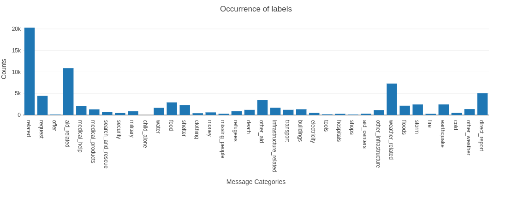

# Disaster Response Pipeline Project

## Project Brief
Build a multi-label classification model that can classifies messages/tweets sent during disasters. By automatically 
classifying tweets and messages related to various disaster into various categories it will allow for various 
affected communities and relief and rescue organisations to save time and discern where and when help is needed.

The repository should demonstrate data engineering skills by building an ETL pipeline and then using the cleaned data in an ML 
pipeline creating a classification model. 

The stored model is then used in a `Flask` webapp which can be used to predict new messages provided by users.

The labelled disaster tweets were provided by [Appen](https://appen.com/).

## Data Exploration

There are a total of 26207 messages in our dataset and they are labelled with one or multiple of 36 different 
classes/labels. These classes along with their occurrence are shown in Fig.1.

<figure>

<figcaption align = "center"><b>Fig.1 - Counts of categories available in messages. </b></figcaption>
</figure>

Straight off the bat we can see that there is significant imbalance in the message labels ranging from 
$\sim$20,000, to a few 100 and even 0 for the **child_alone** label. This imbalance, if not handled properly, can 
lead to a model incapable of providing accurate predictions. 

## Results Summary
### Model metrics
The model used in this work is a `MultiOutputClassier` with a Random Forest classifier and after performing a 
`GridSearchCV` the best parameters were:

| Parameter Name | Value |
|----------------|-------|
| max_depth      | 20    |
| max_features   | auto  |
| n_estimators   | 175   |

This model achieved a relatively high degree of accuracy (usually above 90%) for most message classes/labels. 
However, this accuracy is misleading as it was often the case where the test dataset had few or even no samples 
for particular labels. 

### Considerations, concerns, and improvements
The biggest concern I have with this model is the actual split of the data used for training and testing of our model. 
I've used _sk-learn's_ `train_test_split` in order to create training and test datasets but this cannot guarantee that 
we obtain a balanced representation of each label in our training and test sets. And, the obtained imbalance is evident 
in our evaluation metrics and the inaccurate predictions obtained in the web app. 

In order for this model to provide any value it must use a balanced training set. So for my first improvement I'd be 
interested in looking at the multi-label classification library [scikit-multilearn](http://scikit.ml/) which is 
specifically designed for such problems. 

## Using the model

### Environment Setup Instructions:

I've used [Anaconda](https://www.anaconda.com/) with Python 3.9.2 to create the environment for this work. You 
can use the `requirement.yml` file to create the environment locally using:

```
conda env create -f requirement.yml
```

You can then activate it with

```
conda activate disaster_pipeline
```
This will install various Python packages including `numpy`, `pandas`, `sklearn`, `plotly`, `flask` and their 
dependencies. 

### Run Instructions:
:information_source: The model saved in this repository is stored with [git lfs](https://git-lfs.github.com/) :information_source:

1. Run the following commands in the project's root directory to set up your database and model.

    - To run ETL pipeline that cleans data and stores in database
        `python data/process_data.py data/disaster_messages.csv data/disaster_categories.csv data/DisasterResponse.db`
    - To run ML pipeline that trains classifier and saves
        `python models/train_classifier.py data/DisasterResponse.db models/classifier.pkl`
      - :warning: Note that this step can take a long time. Current setup using 6 cores takes about 1 hour to train. :warning:

2. Run the following command in the app's directory to run your web app.
    `python run.py`

3. Go to http://0.0.0.0:3001/

4. Type in a message and see how well the classifier works.

### File descriptions
Below we have a brief description of the directories and the files they contain. 
- `app` <br>
  &nbsp;| - `template` <br>
  &nbsp;| --- `master.html`: main page of web app <br>
  &nbsp;| --- `go.html`: classification result page of web app <br>
  &nbsp;| - `plotting.py`: contains plotly plot script for webapp <br>
  &nbsp;| - `run.py`: Flask file that runs app <br>
- `data` <br>
  &nbsp;| - `disaster_categories.csv`: data to process <br>
  &nbsp;| - `disaster_messages.csv`: data to process <br>
  &nbsp;| - `process_data.py`: ETL script <br>
  &nbsp;| - `DisasterResponse.db`: database containing cleaned data <br>
- `models` <br>
  &nbsp;| - `train_classifier.py`: ML pipeline script <br>
  &nbsp;| - `classifier.pkl`: enhanced saved model with extra features <br>
  &nbsp;| - `classifierCV.pkl`: original saved model <br>
- `plots` <br>
  &nbsp;| - `category_correlation.png`: plot of correlation between each category <br>
  &nbsp;| - `category_counts.png`: plot of counts in each category <br>
- `README.md`: readme file
- `.gitattributes`: contains files managed by git-lfs
- `.gitignore`: file/folders to ignore
- `environment.yml`: anaconda python environment export
- `requirements.txt`: pip python environment export
- `testing.ipynb`: notebook for used for scratch code

---

<a rel="license" href="http://creativecommons.org/licenses/by-nc-sa/4.0/"></a><br />This work is licensed under a <a rel="license" href="http://creativecommons.org/licenses/by-nc-sa/4.0/">Creative Commons Attribution-NonCommercial-ShareAlike 4.0 International License</a>.