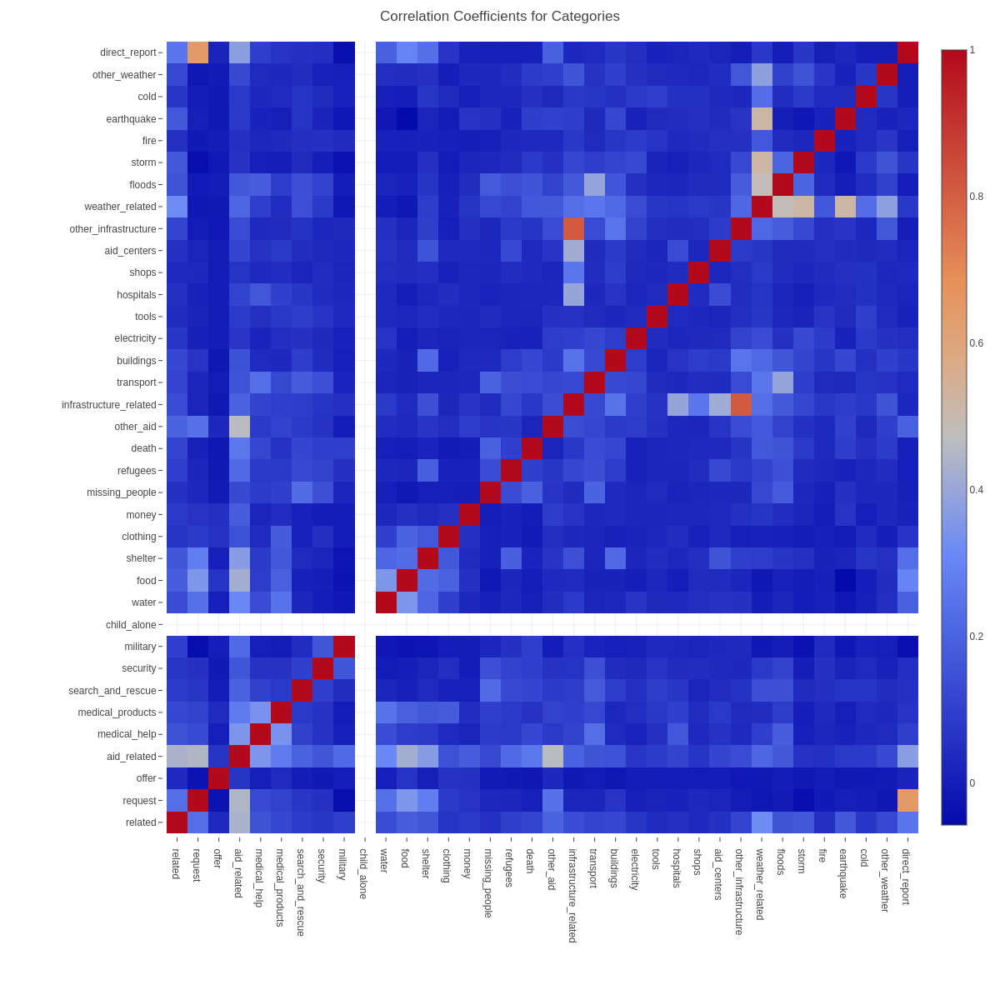

# Disaster Response Pipeline Project

## Project Brief
Build a multi-label classification model that can classifies messages/tweets sent during disasters. The repository
should demonstrate data engineering skills by building an ETL pipeline and then using the cleaned data in an ML 
pipeline creating a classification model. 

The stored model is then used in a `Flask` webapp which can be used to predict new messages provided by users.

The labelled disaster tweets were provided by [Appen](https://appen.com/).

## Summary of Results

### Model metrics
I'm using a MultiOutputClassier with a Random Forest classifier. After performing a GridSearchCV the best
parameters were:

| Parameter Name  | Value  |
|---|---|
| max_depth  | 40  |
| max_features  | auto  |
| n_estimators  | 150  |


### Data Exploration

<figure>

<figcaption align = "center"><b>Fig.1 - Counts of categories available in messages. </b></figcaption>
</figure>

<figure>

<figcaption align = "center"><b>Fig.2 - Linear correlation between categories. </b></figcaption>
</figure>

### Considerations, concerns, and improvements


## Using the model

### Environment Setup Instructions:

I've used [Anaconda](https://www.anaconda.com/) with Python 3.9.2 to create the environment for this work. You can use the `requirement.yml` file to create the environment locally using:

```
conda env create -f requirement.yml
```

You can then activate it with

```
conda activate disaster_pipeline
```
This will install various Python packages including `numpy`, `pandas`, `sklearn`, `plotly`, `flask` and their dependencies. 

### Run Instructions:
1. Run the following commands in the project's root directory to set up your database and model.

    - To run ETL pipeline that cleans data and stores in database
        `python data/process_data.py data/disaster_messages.csv data/disaster_categories.csv data/DisasterResponse.db`
    - To run ML pipeline that trains classifier and saves
        `python models/train_classifier.py data/DisasterResponse.db models/classifier.pkl`
      - :warning: Note that this step can take a long time. Current setup using 6 cores takes about 1 hour to train. :warning:

2. Run the following command in the app's directory to run your web app.
    `python run.py`

3. Go to http://0.0.0.0:3001/

4. Type in a message and see how well the classifier works.

---

<a rel="license" href="http://creativecommons.org/licenses/by-nc-sa/4.0/"></a><br />This work is licensed under a <a rel="license" href="http://creativecommons.org/licenses/by-nc-sa/4.0/">Creative Commons Attribution-NonCommercial-ShareAlike 4.0 International License</a>.